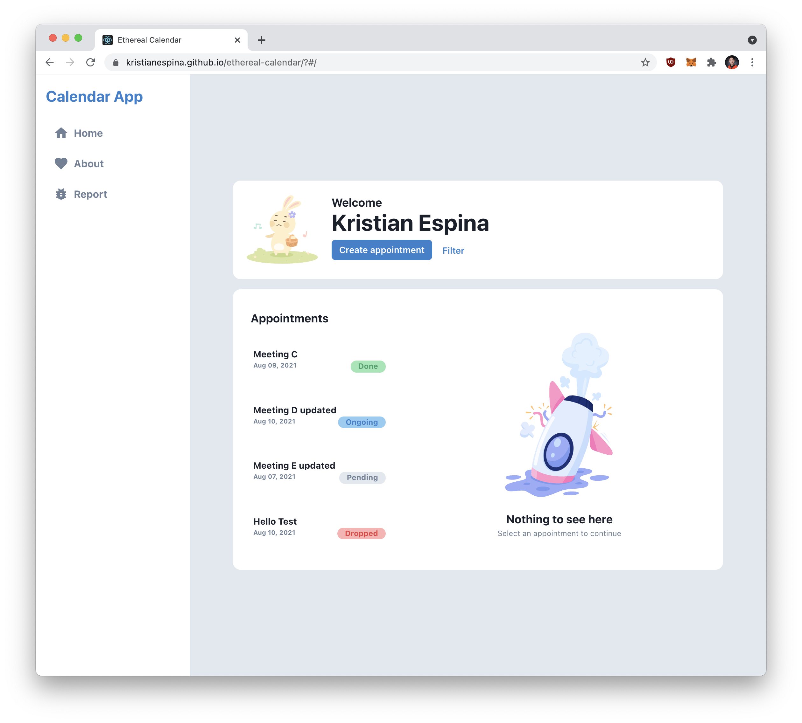
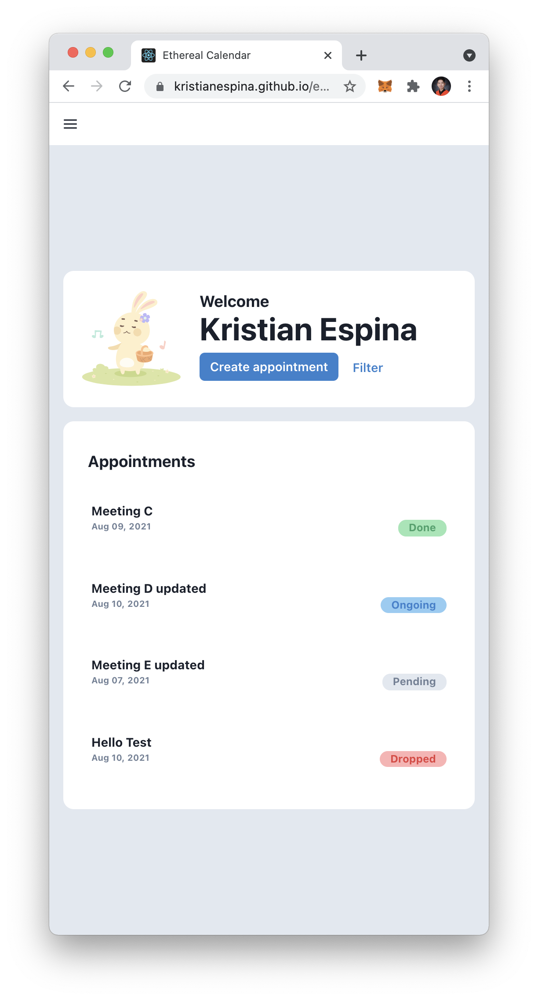

<p align="center">
    <h3 align="center">Ethereal Calendar</h3>

  <p align="center">
    A submission for a technical exam
    <br />
    <a href="#"><strong>Explore the docs »</strong></a>
    <br />
    <br />
    <a href="https://kristianespina.github.io/ethereal-calendar/#/">View Demo</a>
    ·
    <a href="https://github.com/kristianespina/ethereal-calendar">Request Feature</a>
  </p>
</p>

## About

This project is made using the following technologies:

- ReactJS (with Typescript)
- Redux (with ReduxToolkitJS)
- ChakraUI

## Screenshots

### Desktop



### Mobile



## Getting Started

### Installation

#### 1. Install the dependencies

```bash
# at root project directory
npm install # or yarn install
```

#### 2. (Optional) To run the mock server locally modify the .env into

```bash
REACT_APP_API_HOST=http://localhost:3001
```

### Running the servers

To run the mock server

```bash
npm run mock # or yarn mock
```

To run the react on development enviroment

```bash
npm start
```
